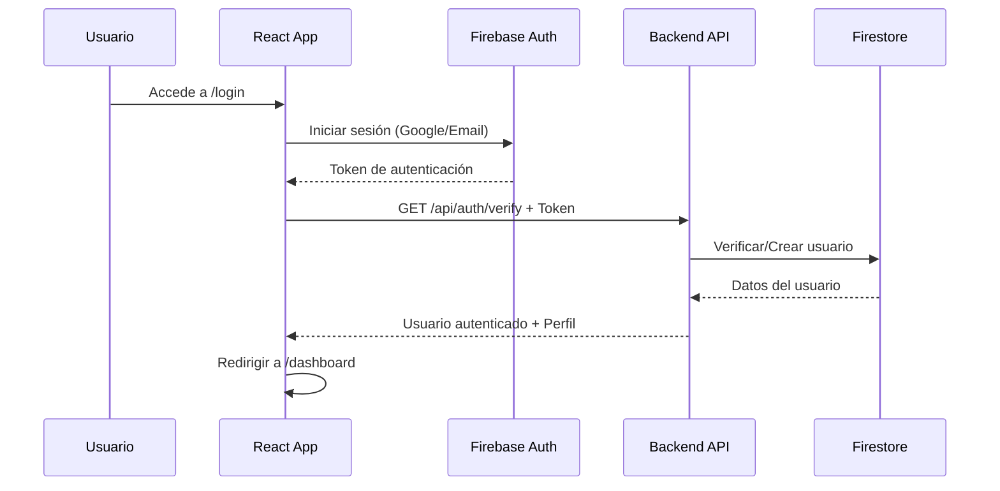
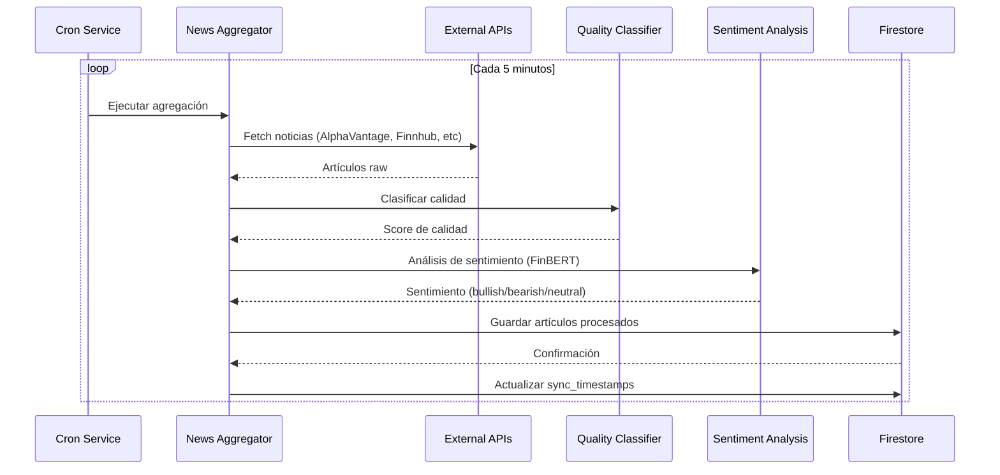
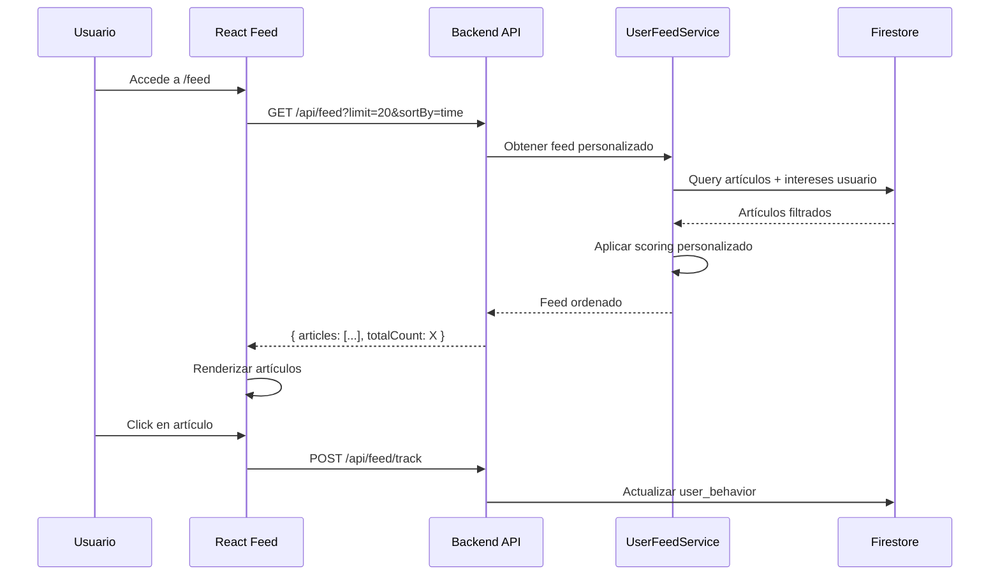
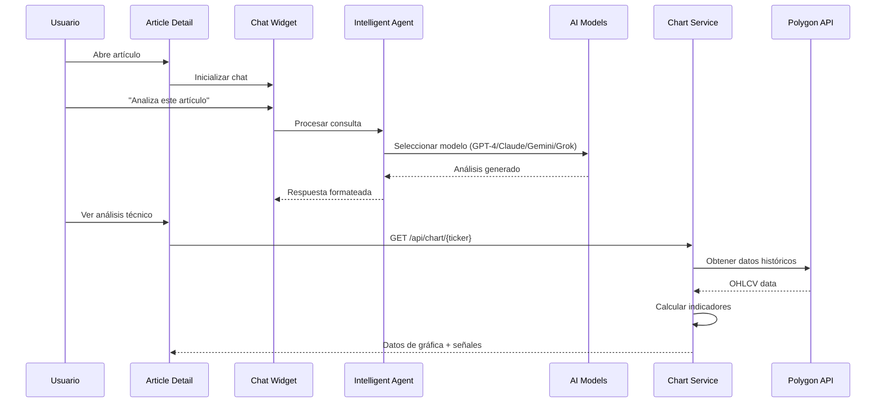
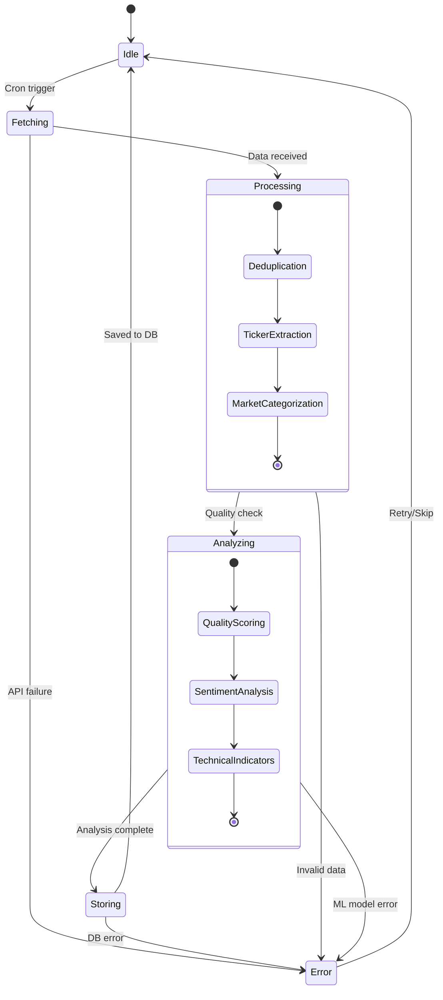

# 🏗️ Financial News App - Arquitectura y Flujo Completo

## 📊 Diagrama de Flujo del Sistema

```mermaid
graph TB
    %% Usuario y Frontend
    User[👤 Usuario] --> Browser[🌐 Navegador Web]
    Browser --> React[⚛️ React App<br/>Puerto: 3000]
    
    %% Autenticación
    React --> FirebaseAuth[🔐 Firebase Auth]
    FirebaseAuth --> GoogleAuth[Google OAuth]
    FirebaseAuth --> EmailAuth[Email/Password]
    
    %% Componentes Frontend
    React --> Dashboard[📊 Dashboard]
    React --> Feed[📰 Feed de Noticias]
    React --> ArticleDetail[📄 Detalle Artículo]
    React --> Settings[⚙️ Configuración]
    
    %% API Backend
    React --> API[🚀 API Express.js<br/>Puerto: 3001]
    
    %% Rutas API
    API --> AuthRoutes[🔑 /api/auth]
    API --> FeedRoutes[📰 /api/feed]
    API --> ArticleRoutes[📄 /api/articles]
    API --> AnalysisRoutes[🧠 /api/analysis]
    API --> DashboardRoutes[📊 /api/dashboard]
    
    %% Servicios Backend
    API --> NewsAggregator[📡 News Aggregator Service]
    API --> QualityClassifier[🎯 Quality Classifier]
    API --> SentimentAnalysis[😊 Sentiment Analysis]
    API --> ChartService[📈 Chart Service]
    API --> UserFeedService[👤 User Feed Service]
    
    %% Fuentes de Datos
    NewsAggregator --> AlphaVantage[AlphaVantage API]
    NewsAggregator --> Finnhub[Finnhub API]
    NewsAggregator --> NewsAPI[NewsAPI]
    NewsAggregator --> Polygon[Polygon.io API]
    
    ChartService --> Polygon
    
    %% Base de Datos
    API --> Firestore[(🔥 Firestore DB<br/>qa-deepcapitals)]
    
    %% Colecciones Firestore
    Firestore --> ArticlesCol[📰 articles]
    Firestore --> UsersCol[👥 users]
    Firestore --> UserBehaviorCol[📊 user_behavior]
    Firestore --> SyncTimestampsCol[⏰ sync_timestamps]
    
    %% Procesamiento IA
    SentimentAnalysis --> HuggingFace[🤗 HuggingFace<br/>FinBERT]
    QualityClassifier --> MLModel[🤖 ML Quality Model]
    
    %% Cron Jobs
    CronService[⏰ Cron Service] --> NewsAggregator
    CronService --> |Cada 5 min| API
    
    %% Chat IA
    ArticleDetail --> ChatWidget[💬 Chat Widget]
    ChatWidget --> IntelligentAgent[🤖 Intelligent Agent]
    IntelligentAgent --> OpenAI[OpenAI GPT-4]
    IntelligentAgent --> Claude[Anthropic Claude]
    IntelligentAgent --> Gemini[Google Gemini]
    IntelligentAgent --> Grok[X.AI Grok]
    
    %% Análisis Técnico
    Dashboard --> TechnicalAnalysis[📊 Análisis Técnico]
    TechnicalAnalysis --> ChartService
    ChartService --> Indicators[📈 Indicadores<br/>RSI, MACD, SMA, Bollinger]
    
    %% i18n
    React --> i18n[🌍 i18next<br/>ES/EN]
    
    style React fill:#61dafb
    style API fill:#68a063
    style Firestore fill:#ffa000
    style HuggingFace fill:#ff6b6b
    style OpenAI fill:#412991
    style Claude fill:#7c3aed
    style Gemini fill:#4285f4
    style Grok fill:#000000
```



## 🔄 Flujo Detallado del Sistema

### 1️⃣ **Flujo de Autenticación**



### 2️⃣ **Flujo de Agregación de Noticias (Cron Job)**



### 3️⃣ **Flujo del Feed Personalizado**



### 4️⃣ **Flujo de Análisis de Artículo**



## 🤖 Agentes y Servicios del Sistema

### **1. News Aggregator Agent** 📰
```javascript
// Responsabilidades:
- Recopilar noticias de múltiples fuentes
- Deduplicar artículos similares
- Extraer tickers mencionados
- Categorizar por tipo de mercado

// Fuentes:
- AlphaVantage News
- Finnhub News  
- NewsAPI
- Polygon News

// Proceso:
1. Fetch paralelo de todas las fuentes
2. Normalización de formato
3. Deduplicación por título/URL
4. Extracción de entidades (tickers)
5. Guardado en Firestore
```

### **2. Quality Classifier Agent** 🎯
```javascript
// Responsabilidades:
- Evaluar calidad del contenido
- Detectar clickbait
- Verificar fuentes confiables
- Asignar score de calidad

// Criterios:
- Longitud del contenido (>200 palabras)
- Fuente verificada
- Presencia de datos/cifras
- Coherencia del título
- Relevancia financiera

// Output:
{
  quality_score: 0-100,
  quality_level: "high" | "medium" | "low",
  factors: {
    content_length: score,
    source_reliability: score,
    data_presence: score,
    title_quality: score
  }
}
```

### **3. Sentiment Analysis Agent (FinBERT)** 😊
```javascript
// Responsabilidades:
- Análisis de sentimiento financiero
- Clasificación bullish/bearish/neutral
- Confianza en la predicción

// Modelo:
- HuggingFace: ProsusAI/finbert
- Entrenado específicamente para textos financieros

// Proceso:
1. Tokenización del texto
2. Inferencia con FinBERT
3. Clasificación de sentimiento
4. Cálculo de confianza

// Output:
{
  sentiment: "bullish" | "bearish" | "neutral",
  confidence: 0.85,
  scores: {
    positive: 0.75,
    neutral: 0.20,
    negative: 0.05
  }
}
```

### **4. Chart Analysis Agent** 📈
```javascript
// Responsabilidades:
- Análisis técnico completo
- Cálculo de indicadores
- Identificación de patrones
- Generación de señales

// Indicadores:
- SMA (20, 50, 200)
- EMA (12, 26)
- RSI (14)
- MACD
- Bollinger Bands
- Fibonacci Retracements

// Patrones:
- Doji
- Hammer/Shooting Star
- Engulfing (Bullish/Bearish)
- Three White Soldiers/Black Crows
- Golden/Death Cross

// Señales de Trading:
{
  recommendation: "BUY" | "SELL" | "HOLD",
  signals: [
    { indicator: "RSI", value: 28, signal: "BUY" },
    { indicator: "MACD", value: 0.5, signal: "BUY" }
  ],
  confidence: 0.75
}
```

### **5. Intelligent Chat Agent** 💬
```javascript
// Responsabilidades:
- Responder preguntas sobre artículos
- Proporcionar análisis profundo
- Generar planes de trading
- Explicar conceptos financieros

// Modelos Disponibles:
1. OpenAI GPT-4: Análisis conservador y preciso
2. Claude 3: Análisis estructurado y detallado
3. Google Gemini: Contexto global multimodal
4. X.AI Grok: Perspectiva directa y única

// Capacidades:
- Análisis técnico del artículo
- Análisis fundamental
- Impacto en mercados
- Recomendaciones de trading
- Educación financiera
```

### **6. User Behavior Agent** 👤
```javascript
// Responsabilidades:
- Tracking de interacciones
- Análisis de preferencias
- Personalización del feed
- Recomendaciones

// Métricas Rastreadas:
{
  articles_read: [],
  reading_time: seconds,
  tickers_clicked: {},
  sectors_interest: {},
  sentiment_preference: {},
  quality_threshold: number
}

// Personalización:
- Feed ordenado por relevancia personal
- Filtrado por intereses
- Peso por comportamiento histórico
```

## 🎮 Prompts para Usar el Sistema

### **Para Desarrolladores**

```bash
# 1. Clonar repositorios
git clone [tu-repo]/financial-news-app
git clone [tu-repo]/api-news

# 2. Instalar dependencias
cd api-news && npm install
cd ../financial-news-app && npm install

# 3. Configurar variables de entorno

## Backend (.env)
POLYGON_API_KEY=your_polygon_api_key
ALPHAVANTAGE_API_KEY=your_alphavantage_key
FINNHUB_API_KEY=your_finnhub_key
NEWS_API_KEY=your_newsapi_key
HUGGINGFACE_API_KEY=your_hf_key
FIREBASE_PROJECT_ID=qa-deepcapitals
OPENAI_API_KEY=your_openai_key
ANTHROPIC_API_KEY=your_claude_key
GEMINI_API_KEY=your_gemini_key
GROK_API_KEY=your_grok_key
PORT=3001

## Frontend (.env)
REACT_APP_API_URL=http://localhost:3001
REACT_APP_FIREBASE_API_KEY=your_firebase_key
REACT_APP_FIREBASE_AUTH_DOMAIN=qa-deepcapitals.firebaseapp.com
REACT_APP_FIREBASE_PROJECT_ID=qa-deepcapitals

# 4. Iniciar servicios
# Terminal 1 - Backend
cd api-news
npm start

# Terminal 2 - Frontend  
cd financial-news-app
npm start

# 5. Acceder a la aplicación
http://localhost:3000
```

### **Para Usuarios Finales**

```markdown
## 🚀 Cómo Usar Financial News App

### 1. Registro e Inicio de Sesión
- Accede a http://localhost:3000
- Regístrate con Google o Email
- Completa tu perfil de intereses

### 2. Configurar Preferencias
- Ve a Settings ⚙️
- Selecciona tus tickers favoritos (AAPL, GOOGL, etc)
- Elige sectores de interés (Tech, Finance, Energy)
- Define tu tolerancia al riesgo

### 3. Dashboard Principal
- **Índices del Mercado**: Datos en tiempo real
- **Tu Portfolio**: Basado en tus intereses
- **Gráficas**: Análisis técnico interactivo
- **Alertas**: Notificaciones importantes

### 4. Feed de Noticias
- Artículos personalizados según tus intereses
- Filtros por sentimiento (Bullish/Bearish/Neutral)
- Indicadores de calidad (High/Medium/Low)
- Ordenamiento por relevancia/tiempo

### 5. Análisis de Artículos
- Click en cualquier artículo
- Lee el análisis de sentimiento
- Consulta el chat IA para profundizar
- Ve gráficas técnicas de tickers mencionados

### 6. Chat Inteligente
Pregunta cosas como:
- "¿Qué significa este artículo para AAPL?"
- "¿Cuál es el impacto en el sector tecnológico?"
- "Dame un plan de trading basado en esta noticia"
- "Explícame los indicadores técnicos"
```

## 📋 Comandos Útiles del Sistema

### **Gestión de Datos**

```bash
# Forzar actualización de noticias
cd api-news
node force-fetch-news.js

# Verificar base de datos
node check-firebase-data.js

# Limpiar artículos duplicados
node services/deduplicationService.js

# Reprocesar sentimientos
node test-finbert.js

# Migrar datos a nuevo formato
node migrate-to-improved.js
```

### **Testing y Debug**

```bash
# Test del agregador de noticias
curl http://localhost:3001/api/news-aggregator/fetch

# Test de análisis de sentimiento
curl http://localhost:3001/api/test-analysis/sentiment \
  -H "Content-Type: application/json" \
  -d '{"text": "Apple stock surges on strong earnings"}'

# Test de calidad
curl http://localhost:3001/api/quality/check \
  -H "Content-Type: application/json" \
  -d '{"article": {...}}'

# Ver logs del cron
tail -f api-news/logs/cron-combined.log
```

## 🔧 Arquitectura Técnica

### **Stack Tecnológico**

```yaml
Frontend:
  - React 18 con TypeScript
  - Tailwind CSS para estilos
  - React Query para cache/fetching
  - i18next para internacionalización
  - Framer Motion para animaciones
  - Recharts para gráficas

Backend:
  - Node.js + Express.js
  - Firebase Admin SDK
  - Firestore como base de datos
  - Cron jobs con node-cron
  - Axios para HTTP requests

IA/ML:
  - HuggingFace Transformers (FinBERT)
  - OpenAI GPT-4
  - Anthropic Claude 3
  - Google Gemini
  - X.AI Grok

APIs Externas:
  - Polygon.io (datos de mercado)
  - AlphaVantage (noticias + datos)
  - Finnhub (noticias financieras)
  - NewsAPI (noticias generales)

Infraestructura:
  - Firebase Authentication
  - Firestore Database
  - Vercel/Netlify para deployment
  - GitHub Actions para CI/CD
```

### **Estructura de Base de Datos**

```javascript
// Colección: articles
{
  id: "unique_id",
  title: "Article title",
  description: "Summary",
  content: "Full content",
  url: "https://source.url",
  source: "Bloomberg",
  author: "John Doe",
  published_at: Timestamp,
  created_at: Timestamp,
  tickers: ["AAPL", "GOOGL"],
  market_type: "stocks",
  sentiment: "bullish",
  sentiment_score: 0.85,
  quality_score: 92,
  quality_level: "high",
  image_url: "https://image.url",
  date_str: "2024-01-15"
}

// Colección: users
{
  uid: "firebase_uid",
  email: "user@email.com",
  displayName: "User Name",
  interests: {
    tickers: ["AAPL", "TSLA"],
    sectors: ["technology", "energy"],
    topics: ["earnings", "analysis"],
    marketTypes: ["stocks", "crypto"]
  },
  preferences: {
    language: "es",
    theme: "dark",
    notifications: true
  },
  created_at: Timestamp
}

// Colección: user_behavior
{
  userId: "firebase_uid",
  behavior: {
    articlesRead: ["article_id_1", "article_id_2"],
    readingTime: 3600,
    lastActive: Timestamp,
    tickerClicks: {
      "AAPL": 15,
      "GOOGL": 8
    },
    sentimentPreference: {
      "bullish": 0.6,
      "neutral": 0.3,
      "bearish": 0.1
    }
  }
}

// Colección: sync_timestamps
{
  provider: "alphavantage",
  lastSync: Timestamp,
  articlesCount: 45,
  status: "success"
}
```

## 🚦 Estados del Sistema



## 📈 Métricas y Monitoreo

### **KPIs del Sistema**

```javascript
{
  // Rendimiento
  api_response_time: "< 200ms",
  feed_load_time: "< 1s",
  article_processing_time: "< 500ms",
  
  // Calidad de Datos
  articles_per_day: "> 100",
  quality_score_avg: "> 70",
  sentiment_accuracy: "> 85%",
  deduplication_rate: "< 5%",
  
  // Usuario
  active_users_daily: "count",
  articles_read_per_user: "avg",
  session_duration: "minutes",
  feature_adoption: {
    chat_usage: "%",
    technical_analysis: "%",
    personalization: "%"
  },
  
  // Sistema
  uptime: "99.9%",
  error_rate: "< 1%",
  cron_success_rate: "> 95%",
  api_quota_usage: {
    polygon: "requests/day",
    openai: "tokens/day",
    huggingface: "requests/hour"
  }
}
```

## 🎯 Roadmap y Mejoras Futuras

1. **Corto Plazo (1-2 semanas)**
   - [ ] WebSocket para actualizaciones en tiempo real
   - [ ] Cache con Redis
   - [ ] Notificaciones push
   - [ ] Export a PDF/Excel

2. **Mediano Plazo (1-2 meses)**
   - [ ] Trading simulado
   - [ ] Backtesting de estrategias
   - [ ] Alertas personalizadas
   - [ ] API pública

3. **Largo Plazo (3-6 meses)**
   - [ ] Mobile app (React Native)
   - [ ] ML personalizado por usuario
   - [ ] Social trading features
   - [ ] Integración con brokers

## 📚 Documentación Adicional

- [API Documentation](http://localhost:3001/api-docs)
- [Frontend Components](/src/components/README.md)
- [Backend Services](/api-news/services/README.md)
- [Database Schema](/docs/DATABASE.md)
- [Deployment Guide](/docs/DEPLOYMENT.md)